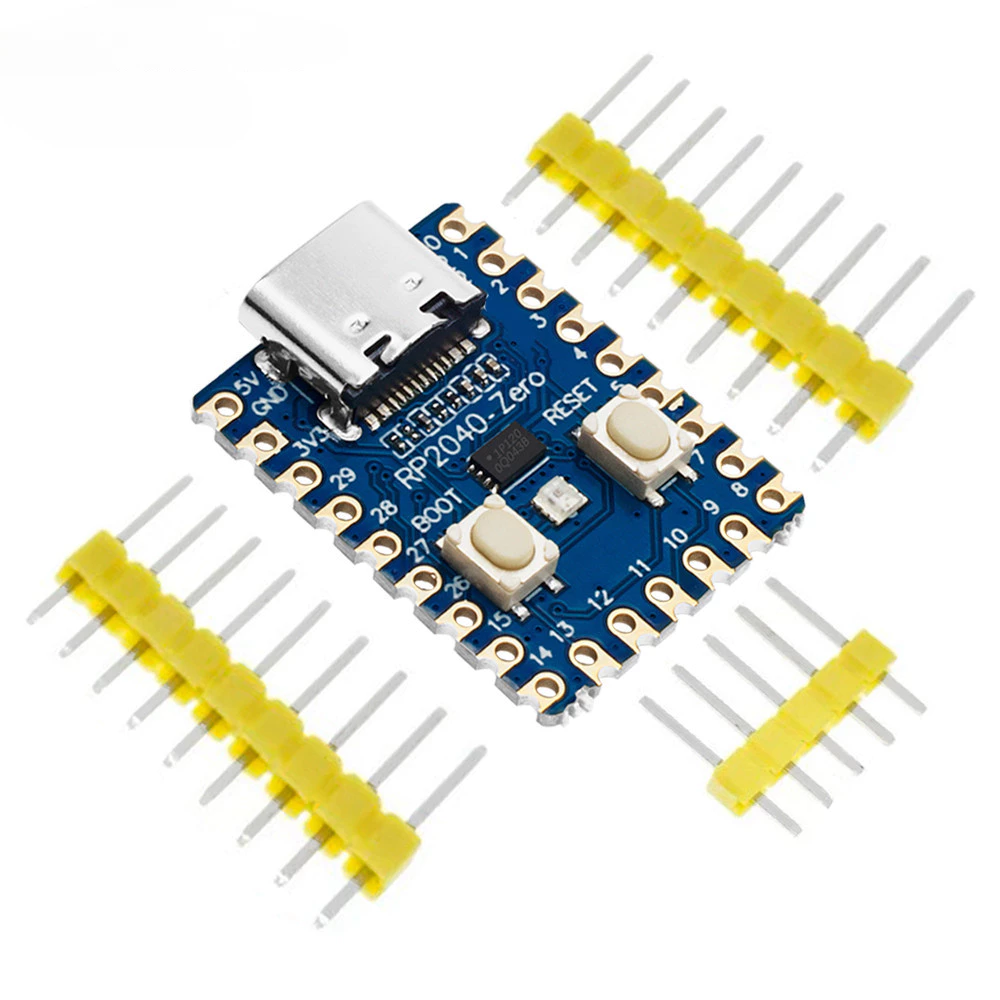

# AIC Pico1

Firmware for the **Waveshare RP2040 Zero**.




This project is a modified build of [AIC Pico](https://github.com/whowechina/aic_pico), adapted for the Waveshare RP2040 Zero.

## Hardware

- Waveshare RP2040 Zero
- PN532 NFC reader
- Add: IC: SDA GPIO 0, SCL GPIO 1 to PN532 GPIOs

## Build

```bash
./build.sh
```

The resulting firmware is `aic_pico.uf2`.

## Credits

Original AIC Pico project and upstream authors:

- https://github.com/whowechina/aic_pico

This repository contains modifications for Waveshare RP2040 Zero hardware.
